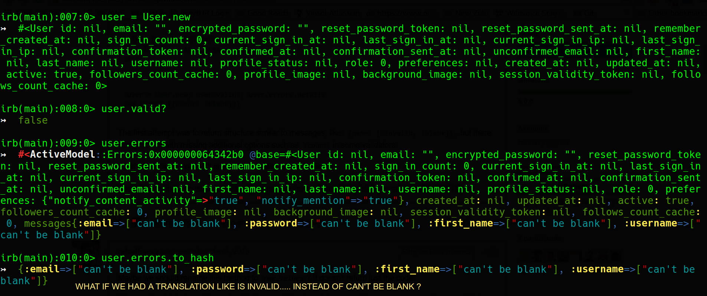
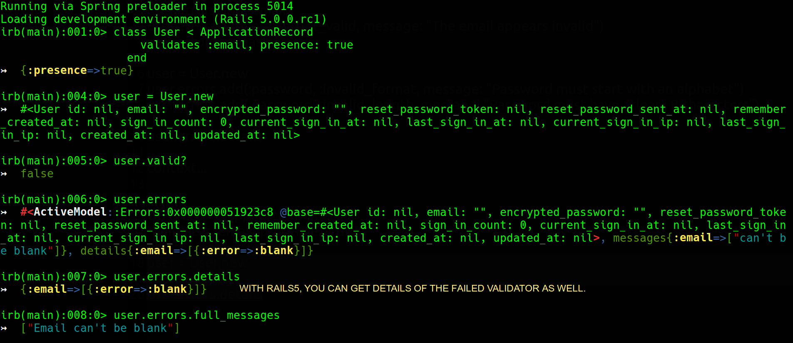
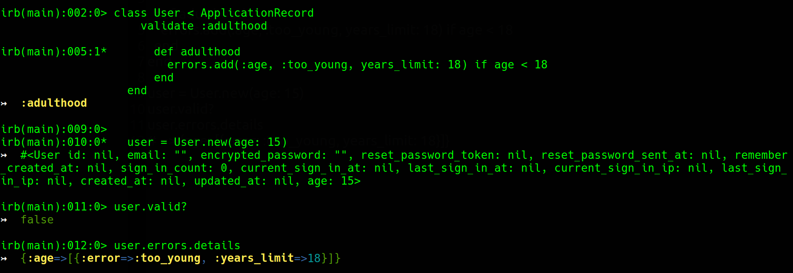
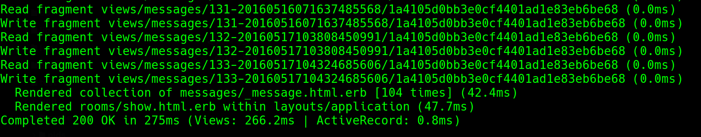
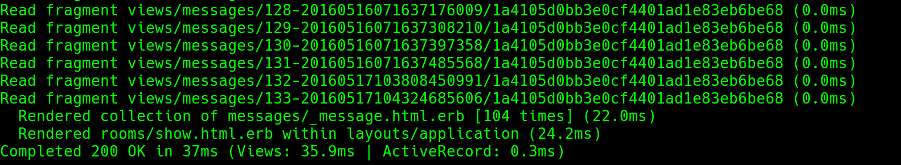
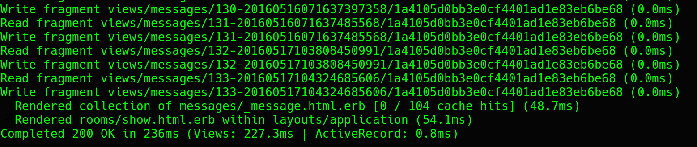
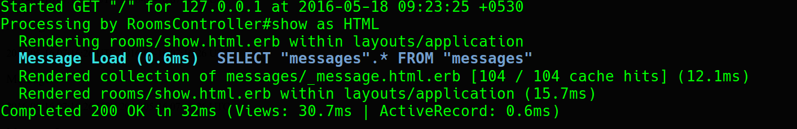
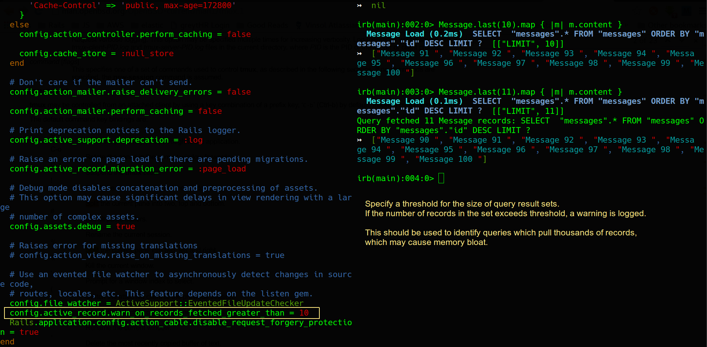

# ActiveModel::Errors#details
Added in [PR#18322](https://github.com/rails/rails/pull/18322)

#### The way it was in Rails4...

> In Rails4, it's impossible to figure out which validations actually failed, as ActiveModel::Errors provides only field name and translated error message.



#### So What's wrong with it... ?

If all you want to do is show flash messages on webpages served from your app only, you probably would have been satisfied with what was already provided in Rails4.
After all, there are production apps out there working the same way.

But that kept something wanting, particularly in context of the APIs.

> APIs are meant to be consumed by programs ( not humans :smile: ) and it makes sense to allow the programs, which are consuming our API, to decide how they want to show any errors to their users.

#### With Rails5, we have a new `ActiveModel::Errors#details` method which makes this possible !




> Now, the consumer of our API can opt to display the error message translations from our rails app... or it may go ahead and implement its own translations.

#### But what about the contextual info in the error messages ?

> You can pass contexts as well, as shown below.



---

# Caching improvements in Rails5

## A cool way to enable / disable caching in dev.

Added in [PR#20961](https://github.com/rails/rails/pull/20961)

>Running `rake dev:cache` will create or remove `tmp/caching-dev.txt`.
>
When this file exists `config.action_controller.perform_caching` will be set to true in `config/environments/development.rb`.
>
Additionally, a server can be started with either `--dev-caching` or `--no-dev-caching` included to toggle caching on startup.

Here's the related code in config/environments/development.rb

```ruby
# Enable/disable caching. By default caching is disabled.
if Rails.root.join('tmp/caching-dev.txt').exist?
  config.action_controller.perform_caching = true

  config.cache_store = :memory_store
  config.public_file_server.headers = {
    'Cache-Control' => 'public, max-age=172800'
  }
else
  config.action_controller.perform_caching = false

  config.cache_store = :null_store
end
```

## Collection Caching: option to read multiple templates from cache at once.
Added in [PR#18948](https://github.com/rails/rails/pull/18948)

#### The problem with one call per template...

Consider the example below:
We have a view which renders a collection template with individual template fragment caching.

```erb
<h1>Chat Room</h1>
<div id="messages">
  <%= render partial: 'messages/message', collection: @messages %>
</div>

<form>
  <label>Say something: </label><br>
  <input type="text" data-behavior="room_speaker">
</form>
```

And here's the template

```erb
<% cache message do %>
  <div class="message">
    <p><% message.id %></p>
    <p><%= message.content %></p>
    <small><%= message.created_at %></small>
    <small><%= message.updated_at %></small>
  </div>
<% end %>
```
###### When cache is cold

Nothing special here... a cache read is attempted for each template digest. If it is a miss, write it to the cache.



###### When cache is hot

As we can see here, an individual request is made to read from the cache.

This is **inefficient**



#### How this problem resolved with rails5

>In Rails5, when rendering a collection of objects that each use the same partial, a `cached`
option can be passed.
>
The `cached: true` will make Action View's rendering read several templates from cache at once instead of one call per template.
>
Sounds efficient !?.. Let's verify that.

To verify, we render the same partial, but this time with `cached` option.

```erb
<h1>Chat Room</h1>
<div id="messages">
  <%= render partial: 'messages/message', collection: @messages, cached: true %>
</div>

<form>
  <label>Say something: </label><br>
  <input type="text" data-behavior="room_speaker">
</form>
```

###### When cache is cold

As we can see, unlike earlier, an attempt is made to read all partial, but this being the first load, we have [0/104 cache hits] and it took a little bit longer for the first load.



> But Caching is all about performance on the subsequent loads.

###### When cache is hot



> The time reduced from 22.0 ms to 12.1 ms... a nice improvement indeed !

---

## config.active_record.warn_on_records_fetched_greater_than

Added in [PR#18846](https://github.com/rails/rails/pull/18846)

> When set to an integer, a warning will be logged whenever a result set
larger than the specified size is returned by a query.
>
This should be used to identify queries which pull thousands of records, which may cause [memory bloat](https://blog.engineyard.com/2009/thats-not-a-memory-leak-its-bloat).



---
